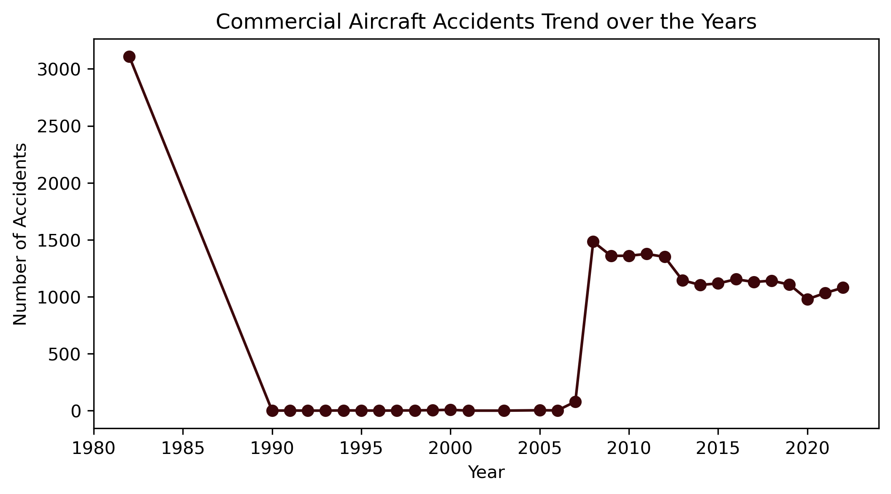

# dsc-finalproject-phase1-moringa

# Aircraft Fleet Selection for a New Airline


**Author**: [Faith Wambugu](mailto:faithwmbg@gmail.com)

## Overview

This project focuses on performing a data-driven safety analysis of historical aviation accidents to inform the strategic selection of aircraft models for a new airline venture. The primary goal is to identify aircraft types that demonstrate the most favorable safety profiles, thereby minimizing operational risk and enhancing public trust in our new business.
The [data](https://www.kaggle.com/datasets/khsamaha/aviation-accident-database-synopses/data) from the National Transportation Safety Board that includes aviation accident data from 1962 to 2023 about civil aviation accidents and selected incidents in the United States and international waters.

## Business Understanding

This presentation is designed for business stakeholders within our new airline company, who may possess a non-technical background. The core objective is to convince them that our data-backed analysis has a significant impact on critical business decisions, specifically influencing the selection of our initial aircraft fleet. Our findings aim to:

- **Reduce operational risk:** By selecting inherently safer aircraft.

- **Enhance brand reputation:** By prioritizing passenger safety above all.

- **Inform strategic investments:** Guiding decisions that align with our long-term success.

## Data Understanding and Analysis

**Source of Data:** The analysis is based on a comprehensive dataset of U.S. aviation accidents obtained from the National Transportation Safety Board (NTSB), as linked above.

**Description of Data:** The dataset contains detailed information about aviation incidents, including accident dates, aircraft models, number of engines, injury counts (fatal, serious, minor, uninjured), and broad phases of flight.

**Methodology:** I employed descriptive statistics and time-series analysis to identify trends, patterns, and critical factors influencing accident outcomes, focusing on their impact on safety. Outliers (representing very severe, though rare, accidents) were intentionally retained to capture the full spectrum of potential risks.

## Key Visualizations

### 1. Injury Trends Over Time

This chart illustrates the aggregate trends in fatal, serious, and minor injuries over the years. Notably, spikes in specific years (e.g., 1982, 2008) highlight the disproportionate impact of a few catastrophic events on overall injury statistics.


### 2. Top Aircraft Makes by Fatalities
This visualization identifies the aircraft manufacturers most frequently associated with fatalities in our dataset (e.g., Cessna, Piper, Beech). Understanding these historical patterns is crucial for risk assessment.


### 3. Fatalities by Broad Phase of Flight
This chart breaks down the distribution of fatalities across different phases of flight (e.g., cruise, takeoff, maneuvering, approach). This highlights which operational stages carry higher risks and informs targeted safety improvements.


**Explore the full interactive analysis on my Tableau Public Dashboard:** [Interactive Aviation Safety Dashboard](https://public.tableau.com/views/U_S_AAviationAccidentsAnalysis/Dashboard1?:language=en-US&:sid=&:redirect=auth&:display_count=n&:origin=viz_share_link)

## Conclusion

Our analysis leads to several key findings crucial for our new airline:

- **Exceptional Safety Records Exist:** Several aircraft models (e.g., LA 4, LA 4 200, LA-4, LAK 12, LAK 17, LAK-17A, LAKE 250, LAKE LA 4 series) demonstrate exceptionally low or zero serious/fatal accident rates within our dataset, making them strong initial contenders when safety is the paramount concern.

- **Importance of Certification:** Aircraft that are not amateur-built generally exhibit better safety profiles, as they must meet stringent industry standards and certification criteria.

- **Addressing Common Accident Factors:** A significant portion of accidents are attributable to pilot inadequacies and loss of engine power, highlighting critical areas for operational focus and pilot training.

## Recommendations

Based on our findings, we propose the following strategic recommendations for our initial fleet and operations:

- **Prioritize Certified, Low-Risk Aircraft:** Focus on commercially certified aircraft models with historically low serious/fatal accident rates.

- **Invest in Redundant Engine Configurations:** When feasible, consider aircraft with three or more engines. Data suggests this configuration correlates with fewer fatalities, offering a safety buffer against engine power loss.

- **Enhance Pilot Training & Assessment:** Implement rigorous and frequent pilot assessment and continuous retraining programs, especially focusing on areas linked to common accident causes.

- **Holistic Investment Approach:** While safety is foundational, aircraft selection must also consider operational costs, fuel efficiency, passenger capacity, market demand, and the availability of qualified pilots and crew.

## Next Steps

Further in-depth analyses are crucial for refining our decision-making. This largely depends on the availability of additional data, including flight hours/exposure data (to calculate true accident rates), more detailed probable cause information for accidents, and specific airline operator data.

## For More Information

See the full analysis in the [Jupyter Notebook](Untitled.ipynb) or review this [presentation](Presentation/Aviation_Analysis_Presentation.pdf).

## Repository Structure

```
|-- Images
|-- Phase1 Final Project
|  |_ AviationData.csv
|-- Presentation
|  |_ Aviation_Analysis_Presentation
|-- README.md
|-- Untitled.ipynb
|-- clean_aviation.csv

```


